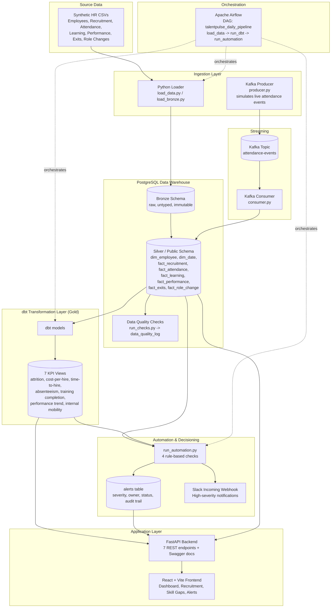

# TalentPulse — Architecture

## End-to-End Architecture Diagram

## Layer-by-layer description

### 1. Source Data
Synthetic HR data generated with Python's Faker library (`data_generator/generate_data.py`), covering 6 required entities from the project brief: Employees (300), Recruitment (500, with per-source cost), Attendance (~19,500 daily records over 90 days), Learning (~900), Performance (1,200 quarterly reviews), Exits (45), plus an added Role Changes table (60 records) to support the Internal Mobility KPI.

### 2. Ingestion
- **Batch ingestion**: `warehouse/load_data.py` reads the CSVs and loads them into the warehouse (Silver layer), with `TRUNCATE` + reload for safe re-runs.
- **Raw ingestion**: `warehouse/load_bronze.py` loads the same CSVs, untouched and as TEXT, into a dedicated `bronze` schema — this is the immutable raw copy required by the brief.
- **Streaming ingestion**: `streaming/producer.py` simulates a live HR system generating attendance check-in events every 2 seconds, sent to a Kafka topic.

### 3. Streaming (Kafka)
Kafka (`apache/kafka:3.8.0`, KRaft mode, no Zookeeper needed) runs a single topic, `attendance-events`. `streaming/consumer.py` subscribes to this topic and inserts each event directly into `fact_attendance` in near real time, demonstrating the "live streaming" requirement end-to-end.

### 4. Warehouse (PostgreSQL)
A star schema with 2 dimension tables (`dim_employee`, `dim_date`) and 5 fact tables (`fact_recruitment`, `fact_attendance`, `fact_learning`, `fact_performance`, `fact_exits`, plus `fact_role_change`). Referential integrity is enforced via foreign keys, and every fact table carries a `loaded_at` audit column.

### 5. Data Quality
`data_quality/run_checks.py` runs 10 checks across null checks, duplicate checks, uniqueness, referential integrity, valid-range/business-rule checks, and freshness/volume checks, logging every result (pass/fail + details) to `data_quality_log` for auditability.

### 6. Transformation (dbt) — the Gold/Analytics layer
dbt models sit on top of the warehouse tables (declared as dbt `sources`) and compute the 7 required KPIs as SQL views: attrition rate, cost-per-hire, time-to-hire, absenteeism, training completion, performance trend, and internal mobility.

### 7. Automation & Decisioning
`automation/run_automation.py` implements 4 rule-based triggers (replacing the ML module per project scope agreement):
- High Attrition Risk (high absenteeism + low performance) → Manager workflow
- Recruitment SLA Breach (stuck in a stage too long) → Recruiter alert
- Skill Gap (multiple incomplete/failed courses) → Learning recommendation
- Absenteeism Anomaly (department threshold breach) → HR review

Every alert is logged with severity, owner, status, and timestamps in the `alerts` table. High-severity alerts additionally trigger a real-time Slack notification via an Incoming Webhook.

### 8. Orchestration (Airflow)
A single-container Apache Airflow instance (SequentialExecutor + SQLite metadata store, chosen for a resource-constrained development machine) runs the DAG `talentpulse_daily_pipeline` on a daily schedule, sequencing: load data → run dbt models → run automation checks, with retries configured.

### 9. Serving Layer
- **FastAPI backend** (`backend/main.py`): exposes workforce, recruitment, employee, skill-gap, dashboard, and alert data via REST, with interactive Swagger documentation at `/docs`.
- **React + Vite frontend**: a 4-tab dashboard (Dashboard/KPIs, Recruitment Funnel, Skill Gap Center, Alert Center) consuming the API live, including an "Acknowledge" action on alerts that writes back to the database.

## Technology choices vs. brief recommendations

| Brief recommendation | Used | Note |
|---|---|---|
| Kafka | Apache Kafka (Docker) | KRaft mode, no Zookeeper |
| PySpark | Pandas | Dataset size didn't warrant distributed processing |
| BigQuery/Snowflake | PostgreSQL | Local, free, sufficient for project scale |
| dbt | dbt-postgres | As recommended |
| Airflow | Apache Airflow (Docker, standalone mode) | Single-container, lightweight config due to 8GB RAM dev machine |
| FastAPI | FastAPI | As recommended |
| React/Next.js | React + Vite | Lighter tooling than Next.js for this scope |
| Docker | Docker Desktop + Docker Compose | Postgres, Kafka, Airflow containerized |
